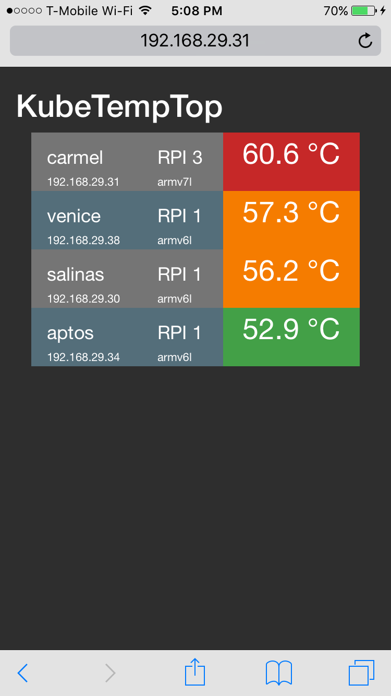

== KubeTemp / RPITemp

Monitor Raspberry PI or x86 Kubernetes cluster node cpu temperature.

NOTE: cAdvisor is the 'build in' Kubernetes node monitoring dashboard
(cpu, network, disk, processes) and API server. It does however not
monitor the cpu temperatures. 

=== API

==== rpi_temp

cpu temperature for a single Kubernetes cluster node.

url: http://aptos:30001/

JSON response:

{"temp":"48.6","cpuArch":"armv6l","hostName":"rpitemp3-zb55u"}

NOTE: hostName is the Kubernetes pod name. 

==== kube_temp

cpu temperature for all active Kubernetes cluster nodes.

url: http://carmel:9999/kubetemp

JSON response:

----
[{"ipAddress":"192.168.29.30","hostName":"salinas.mesgtone.lan.","nodeTemp":{"temp":"51.3","cpuArch":"armv6l","hostName":"rpitemp3-b9kjq"}},{"ipAddress":"192.168.29.31","hostName":"carmel.mesgtone.lan.","nodeTemp":{"temp":"53.6","cpuArch":"armv7l","hostName":"rpitemp3-yprbv"}},{"ipAddress":"192.168.29.34","hostName":"aptos.mesgtone.lan.","nodeTemp":{"temp":"47.6","cpuArch":"armv6l","hostName":"rpitemp3-zb55u"}},{"ipAddress":"192.168.29.38","hostName":"venice.mesgtone.lan.","nodeTemp":{"temp":"51.3","cpuArch":"armv6l","hostName":"rpitemp3-wmbmh"}}]
----

=== Minimal web app:

url: http://carmel:9999/index.html +
url: http://carmel:9999

HTML response:

----
192.168.29.30: salinas.mesgtone.lan.: armv6l: 50.8 °C
192.168.29.31: carmel.mesgtone.lan.: armv7l: 53.1 °C
192.168.29.34: aptos.mesgtone.lan.: armv6l: 48.1 °C
192.168.29.38: venice.mesgtone.lan.: armv6l: 51.3 °C
----

=== Single page web app (SPA):

Using the following frameworks: 

* Bootstrap: responsive, cross platform (Twitter, http://getbootstrap.com/)
* jQuery: REST request (https://jquery.com/)
* vue.js: reactive data binding (http://vuejs.org/)(Note: not current used, JS setInterval() turned out to be sufficient)

url: http://192.168.29.31:9999/kubetemptop.html

screenshot:

